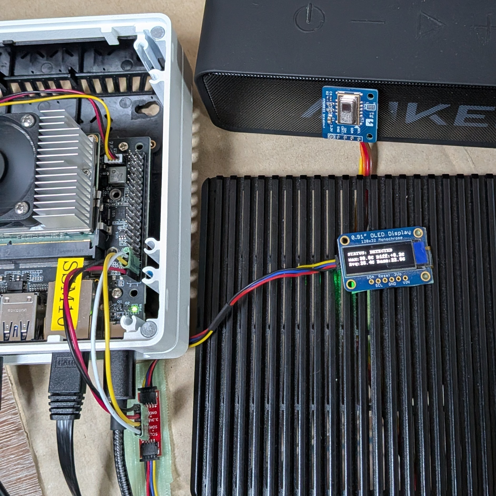
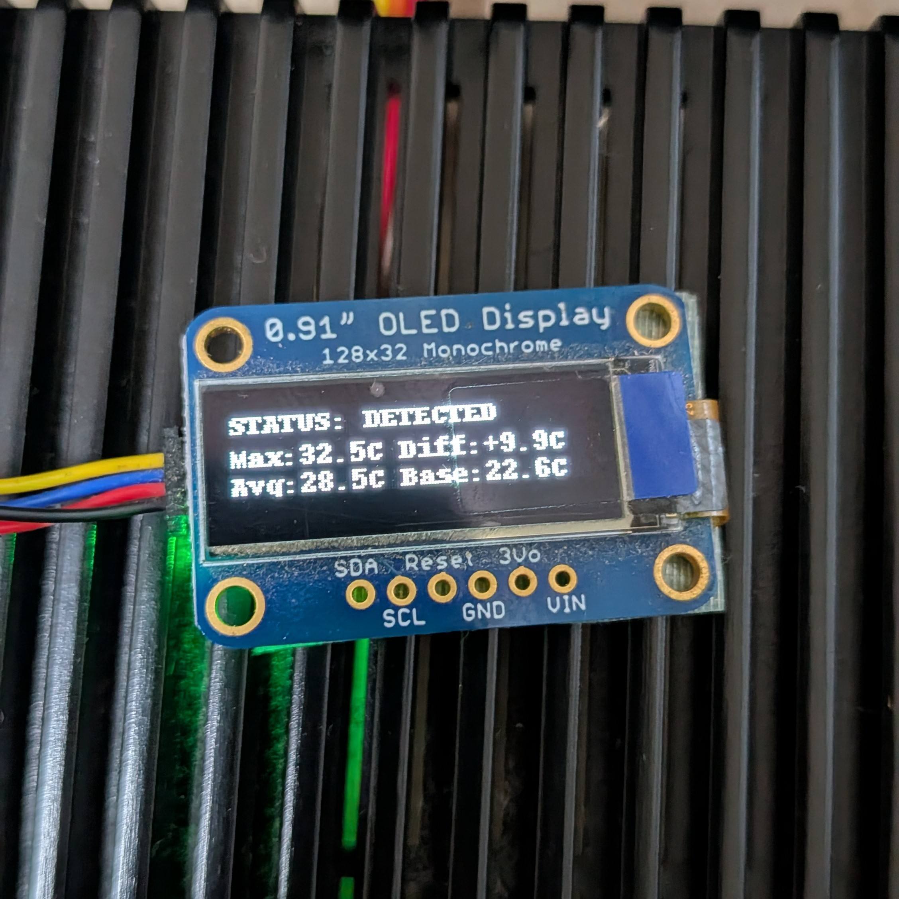

# OLED Module - Devkit 0.4.0

このディレクトリは、Raspberry Pi用のOLEDディスプレイ（SSD1306）とセンサーの統合制御スクリプトです。

## ハードウェア

- **OLED Display**: SSD1306 (128x32) - I2Cアドレス: 0x3C
- **Thermal Sensor**: AMG8833 (8x8) - I2Cアドレス: 0x68
- **I2Cバス**: /dev/i2c-1（ポート1）

---

## Pythonスクリプト一覧

### 1. `1_otest.py` - OLED基本動作テスト

**説明**: OLEDディスプレイの基本的な動作確認スクリプト

**機能**:
- I2C経由でSSD1306 OLEDを初期化
- テキスト表示機能のテスト
- 2行のメッセージ表示（デフォルト: "System OK" と "CH1-4: Running"）
- 5秒間表示して終了

**主要機能**:
```python
show_status(line1, line2="")  # 指定したテキストをOLEDに表示
```

**使用例**:
```bash
python3 1_otest.py
```

---

### 2. `2_printip.py` - ネットワークIP表示

**説明**: 複数のネットワークインターフェースのIPアドレスをOLEDに表示・ローテーション表示するスクリプト

**機能**:
- システムのホストネーム取得
- すべてのIPv4アドレスを自動検出（ループバック除外）
- OLEDに以下の情報をローテーション表示：
  - ホストネーム
  - ネットワークインターフェース名
  - IPアドレス
- 5秒ごとに異なるインターフェースを表示
- ターミナルに検出したIP一覧をログ出力

**主要関数**:
- `get_ip_addresses()`: ネットワークインターフェースのIP取得
- `get_hostname()`: ホスト名取得
- `main()`: メインループ（Ctrl+Cで終了）

**使用例**:
```bash
python3 2_printip.py
```

---

### 3. `3_amg_chk.py` - AMG8833センサー診断

**説明**: 8x8サーマルセンサー（AMG8833）の動作テスト・温度表示・人検知実装

**機能**:
- I2Cでセンサーを初期化
- 64ピクセル（8x8）の温度データを読み取り
- ターミナルにASCIIアートのカラーヒートマップで表示
  - 青（低温）→赤（高温）のグラデーション
  - キャラクター濃度で温度を視覚化
- 人検知機能：
  - 起動時の環境温度をベースラインとして計測
  - 最大温度がベースラインから3℃以上高い場合「検知」と判定
- リアルタイム表示：基板温度、画素平均温度、最大温度

**AMG8833 クラス**:
- `read_thermistor()`: 基板温度取得
- `read_pixels()`: 64ピクセルの温度取得

**使用例**:
```bash
python3 3_amg_chk.py
```

---

### 4. `4_AMGoled.py` - AMG8833 + OLED統合制御

**説明**: サーマルセンサーとOLEDを統合した人検知表示システム

**機能**:
- **AMG8833センサー**: リアルタイム温度データ取得
- **SSD1306 OLED**: 検知結果をリアルタイム表示
- **ステータス表示**: OLEDに以下を3行表示
  - 行1: 検知状態（`DETECTED` または `CLEAR`）
  - 行2: 最大温度と温度差（差分）
  - 行3: 平均温度とベースライン温度
- **ターミナルログ**: 検知イベントとセンサー値をタイムスタンプ付きでログ出力
- **負荷軽減**: `OLED_REFRESH_EVERY`パラメータでOLED更新頻度を調整可能

**主要クラス**:
- `AMG8833`: センサー制御（ピクセル読み取り）
- `StatusDisplay`: OLED制御（ステータス表示・クリア）

**設定値**:
- `PRESENCE_THRESHOLD`: 人検知の温度差閾値（デフォルト: 3℃）
- `UPDATE_INTERVAL`: センサー読み取り間隔（デフォルト: 0.3秒）
- `OLED_REFRESH_EVERY`: OLED更新サイクル間隔（デフォルト: 5回に1回）

**使用例**:
```bash
python3 4_AMGoled.py
```

---

## セットアップ・実行方法

### 必要なライブラリ

```bash
pip3 install luma.oled luma.core pillow smbus2
```

### I2C有効化

```bash
sudo raspi-config
# Interfacing Options → I2C → Enable
```

### I2Cデバイス確認

```bash
i2cdetect -y 1
```

出力例:
```
     0  1  2  3  4  5  6  7  8  9  a  b  c  d  e  f
00:          -- -- -- -- -- -- -- -- -- -- -- -- -- 
10: -- -- -- -- -- -- -- -- -- -- -- -- -- -- -- -- 
20: -- -- -- -- -- -- -- -- -- -- -- -- -- -- -- -- 
30: -- -- -- -- -- -- -- -- -- -- -- -- 3c -- -- -- 
40: -- -- -- -- -- -- -- -- -- -- -- -- -- -- -- -- 
50: -- -- -- -- -- -- -- -- -- -- -- -- -- -- -- -- 
60: -- -- -- -- -- -- -- -- 68 -- -- -- -- -- -- -- 
70: -- -- -- -- -- -- -- --                         
```

- `3c` = OLED (SSD1306)
- `68` = Thermal Sensor (AMG8833)

---

## ハードウェア接続例

```
Raspberry Pi       OLED (SSD1306)
GPIO3 (SDA) ----> SDA
GPIO5 (SCL) ----> SCL
3.3V -----------> VCC
GND -----------> GND

Raspberry Pi       Thermal Sensor (AMG8833)
GPIO3 (SDA) ----> SDA
GPIO5 (SCL) ----> SCL
3.3V -----------> VCC
GND -----------> GND
```

---

## 写真・イメージ

### セットアップ写真





---

## トラブルシューティング

| 問題 | 原因 | 対策 |
|------|------|------|
| `I2CError: [Errno 121]` | I2Cデバイスが見つからない | `i2cdetect -y 1`で確認し、配線を確認 |
| OLEDに何も表示されない | アドレス不正またはハードウェア不良 | アドレス値を変更してテスト |
| センサーが読めない | AMG8833アドレス不正 | 3_amg_chk.pyで診断 |
| 人検知精度が低い | 閾値設定不適切 | `PRESENCE_THRESHOLD`を調整（2～5℃） |

---

## 参考リンク

- [Luma OLED Documentation](https://luma-oled.readthedocs.io/)
- [SSD1306 Datasheet](https://cdn-shop.adafruit.com/datasheets/SSD1306.pdf)
- [AMG8833 Datasheet](https://pir.panasonic.com/en_US)
