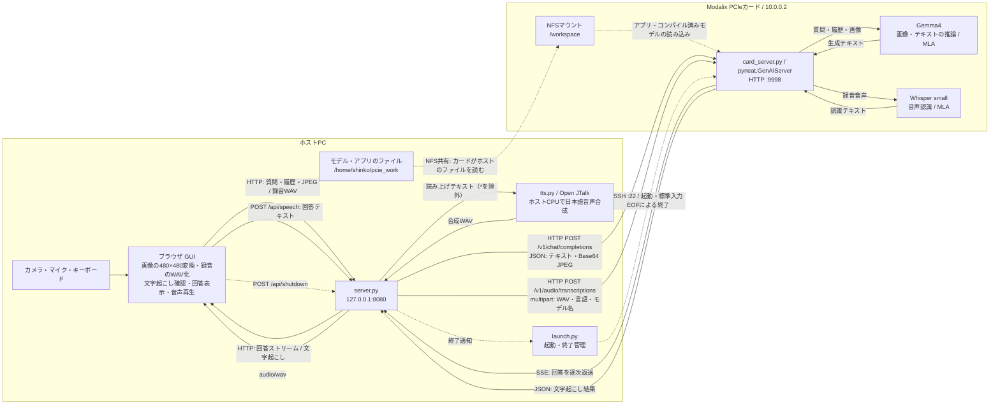

# Gemma4 音声・カメラ・キー入力アシスタント

`neat/models_genai/gemma-4-E2B-it-GPTQ-a16w4` を使う日本語Webアプリです。
音声は同じディレクトリの `whisper-small-a16w8` で文字起こしし、確認後にGemma4へ送ります。
カメラ画像と質問を一緒に送信でき、回答を逐次表示します。

## 起動

Python側は標準ライブラリのみを使います。読み上げにはアプリ内に配置済みのOpen JTalkを使います。

```bash
cd /home/shinko/pcie_work/llm
./run.sh
```

モデルロード後、端末に表示されたURLをホストのChromeで開きます（通常 **http://localhost:8080**）。
8080番が使用中なら、8081〜8100番から空きポートを自動選択します。
`--port` で明示したポートが使用中の場合は、説明を表示して終了します。
終了は画面右上の **「終了」ボタン**、または起動した端末で **Ctrl+C**。
UIと、このコマンドが起動したカード側サーバーを終了します。
終了ボタンは録音中・回答生成中も使用でき、カメラ・マイク・読み上げも停止します。
ブラウザのタブは残るため、終了要求の受付表示が出たら閉じてください。
`--external-server` 使用時は共有のカード側サーバーを残し、このアプリのみ終了します。
カメラ・マイクへのアクセスはブラウザ上で許可してください。

## 操作

- キー入力: メッセージを入力し、送信またはEnter。Shift+Enterは改行。日本語変換中のEnterでは送信しません。
- カメラ: カメラを選択して開始し、「撮影して添付」。または「送信時のカメラ画像を添付」を有効にします。
- 音声: マイクを選んで録音を開始し、もう一度押して停止。最大30秒です。文字起こしを編集して送信できます。
- 音声と画像: カメラ画像を添付して録音し、文字起こしを確認して送信します。
- 読み上げ: チェックを入れると、ホストPC上のOpen JTalkで日本語WAVを生成して再生します。インターネット接続は不要です。`*` は発音せず、表示には残します。音声プレーヤーで一時停止・再生ができ、チェックを外すと停止します。
- 新しい会話: 会話履歴と添付画像を消去します。

画像は縦横比を維持し、黒帯を加えて480×480のJPEGにします。
モデルは1リクエスト1画像です。会話履歴は直近4往復までのテキストのみで、文字数に応じて古い往復を省きます。
過去の画像は再送しません。画像について続けて質問するときは再添付してください。
回答の上限は512トークン。ライブ動画の連続解析ではなく、送信時の静止画解析です。

## オフライン音声再生

`vendor/open-jtalk/` に実行ファイル・共有ライブラリ・日本語辞書・音声モデルを配置済みです。
クラウド音声合成やブラウザの `speechSynthesis` は使用しません。
初期ファイルの取得後は、音声生成・再生時に外部ネットワークへアクセスしません。
Gemma4・Whisperの利用には引き続きローカルのカード接続が必要です。

別環境へ移す場合は `vendor/` も一緒にコピーしてください（Ubuntu 22.04 x86_64用）。
再配置する場合は `./setup_tts.sh` を実行します。`vendor/debs/` の取得済みパッケージを優先し、
未取得の場合のみUbuntuパッケージサーバーからダウンロードします。管理者権限は不要です。
各コンポーネントのライセンスは `vendor/open-jtalk/usr/share/doc/*/copyright` に保持しています。

ブラウザが自動再生を制限した場合は、表示される音声プレーヤーの再生ボタンを押してください。

## 構成・前提

```text
ブラウザ（ホストのカメラ・マイク・キーボード）
  → localhost:8080 / server.py
  → 10.0.0.2:9998 / card_server.py / pyneat.GenAIServer
  → Gemma4 + Whisper / Modalix MLA
```

モデルは通常の `pyneatpcie.Model` 用tarアーカイブではなく、LLiMa用のコンパイル済みGenAIモデルです。
推論はPCIeカード上で行い、リクエストはカードの管理ネットワーク上のHTTP APIを使います。
カード側の実行に `/home/sima/pyneat/bin/python`（pyneat 0.4.0）を使用します。

### ホスト・カード間のデータフロー

実線は入力・推論結果の流れ、点線は起動・終了制御とモデルファイルの読み込みです。
ホスト側の音声合成を含め、以下の処理はインターネット接続なしで動作します。
ポート番号は既定値です。



ホスト・カード間で使用する通信は次のとおりです。

| 用途 | ホスト → カード | カード → ホスト |
| --- | --- | --- |
| 画像・テキストの質問 | `/v1/chat/completions` に質問、テキスト履歴、必要なら1枚のBase64 JPEGをJSONで送信 | SSEで生成テキストを逐次返送 |
| 音声認識 | `/v1/audio/transcriptions` に16kHz・モノラル・16bit PCM WAVをmultipartで送信 | JSONで認識テキストなどを返送 |
| 状態確認 | `/v1/models` にHTTP GET | 利用可能なモデル名をJSONで返送 |
| 起動・終了 | SSHでカード側Pythonを起動。終了時はSSHの標準入力を閉じる | 起動・推論ログをSSH経由で返送し、ホストの `card.log` に記録 |
| モデル・アプリの読み込み | NFS共有からファイルデータを提供 | `/workspace` 経由でホスト上のファイルを読み込み |

音声入力はまずWhisperで文字起こしし、ブラウザで確認・編集してからGemma4へ質問として送信します。
カメラの連続映像はブラウザ内で表示し、送信操作時の静止画だけをカードへ渡します。
回答の読み上げはホスト内の `/api/speech` → Open JTalk → WAV再生で完結します。

このアプリのホスト・カード間の推論データ転送は、管理ネットワーク上のHTTPです。
`pyneatpcie.Model` のテンソル転送APIは使用していません。
`--external-server` 指定時はSSHによる起動・終了制御を行わず、既存のカード側HTTPサーバーへ接続します。

確認済みの環境:

- カード: `sima@10.0.0.2`、パスワードなしSSH
- ホスト `/home/shinko/pcie_work` がカード `/workspace` にNFSマウント済み
- カード `/workspace/neat/models_genai` にGemma4・Whisperの `devkit/` と `elf_files/` が存在
- ホスト: Python 3.10、Chrome、USBカメラ・音声デバイス

ランタイム更新、モデルの再コンパイル、モデルファイルの変更は行いません。
アプリ起動時に2モデルをロードし、終了時に解放します。既存APIのポートが使用中の場合は上書きせず終了します。

設定例:

```bash
./run.sh --port 8081
./run.sh --card 10.0.0.2 --card-workspace /workspace --startup-timeout 300
# すでに gemma4 / whisper を配信しているサーバーを利用する場合
./run.sh --external-server
```

`--external-server` では既存のカードサーバーを起動・停止しません。
起動ログは `card.log`（次回起動時に上書き）です。

UIはlocalhostにバインドします。別PCから使う場合はSSHトンネルでこのホストの8080を転送し、
そのPCで `http://localhost:8080` を開くと、手元のカメラ・マイクを使えます。
HTTPのLANアドレスではブラウザがカメラ・マイクを許可しない場合があります。

## 検証

```bash
python3 -m unittest discover -s tests -v
node --check static/app.js
```

実機でテキスト回答、USBカメラの撮影画像の説明、付属音声の文字起こしを確認済みです。
ブラウザ自動テストでは疑似カメラ・疑似マイクから実際のカードAPIに接続し、IME、送信、
画像添付、録音→WAV変換→文字起こし、会話クリア、JavaScriptエラーがないことを確認しました。
マイクの実際の発話と日本語音声の認識精度、読み上げの聴感は未確認です。

ブラウザテストは任意でPlaywrightが必要です（通常実行には不要）。

```bash
python3 -m venv .venv-test
.venv-test/bin/pip install playwright
# ./run.sh を別端末で起動してから実行。WAVは任意の発話音声。
.venv-test/bin/python tests/browser_smoke.py --wav test-results/speech.wav
```

結果画像: `test-results/browser.png`。テスト素材とログはGit対象外です。
モデルロードに失敗した場合は `card.log`、カメラ・マイクに失敗した場合はブラウザのサイト権限とデバイス選択を確認してください。
